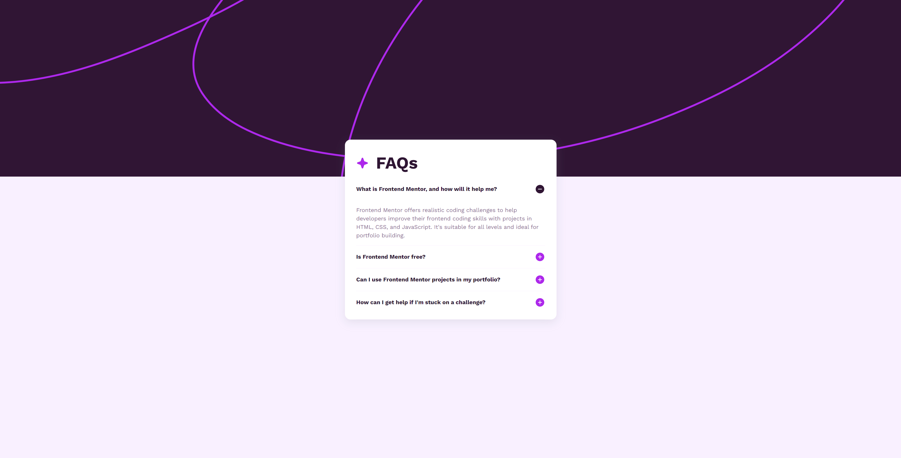

# Frontend Mentor - Recipe page solution

This is a solution to the [FAQ accordion challenge on Frontend Mentor](https://www.frontendmentor.io/challenges/faq-accordion-wyfFdeBwBz). Frontend Mentor challenges help you improve your coding skills by building realistic projects.

## Table of contents

- [Screenshot](#screenshot)
- [Built with](#built-with)
- [What I learned](#what-i-learned)
- [Author](#author)

### Screenshot

- Live Site URL: (https://faq-sheet.netlify.app)

### Built with

- Semantic HTML5 markup
- CSS3
- JavaScript

### What I learned

- Practiced Single Responsibility Principle (SRP) from SOLID
- Position property in CSS to center the accordion
- Semantic HTML5 Markup

## Author

- LinkedIn - [Muhammad Raza](https://www.linkedin.com/in/frontend-developer-muhammad-raza/)
- Frontend Mentor - [@illusiveCode](https://www.frontendmentor.io/profile/illusiveCode)

### Thanks for reading!
